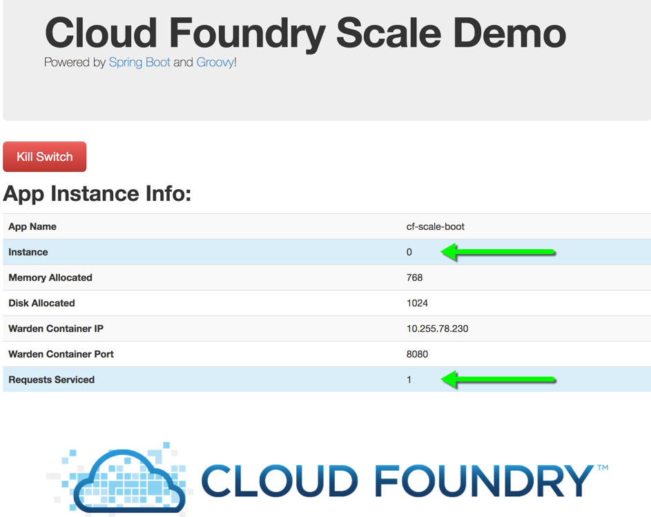
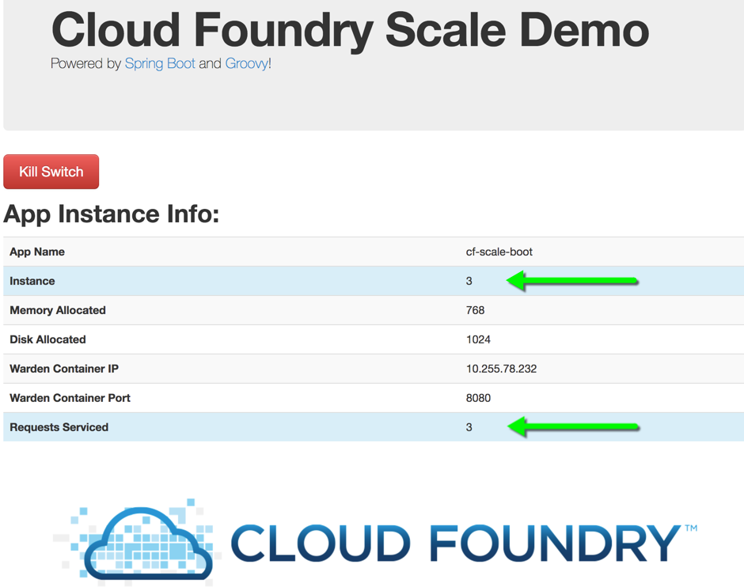
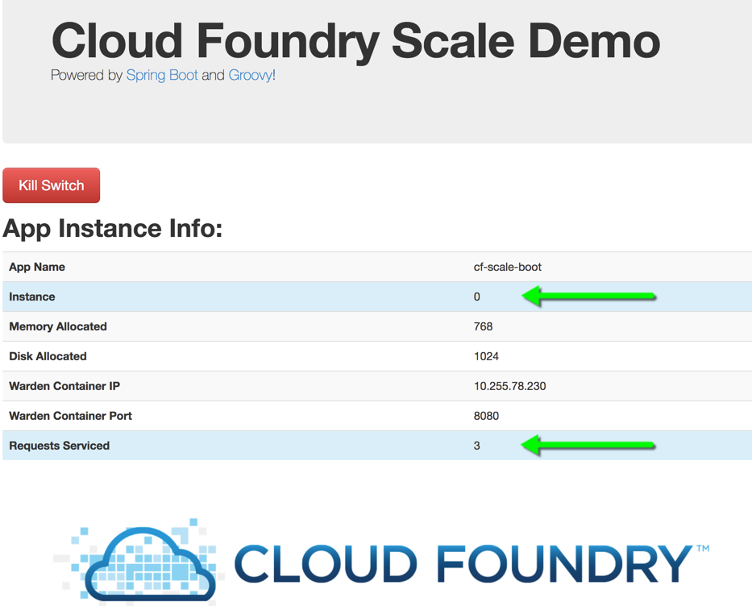

= Lab 3 - Scaling Applications

[abstract]
--
Cloud Foundry makes the work of horizontally scaling application instances and updating load balancer routing tables easy.

In this lab, we'll use a Spring Boot CLI app designed to illustrate Cloud Foundry operations such as scaling.
--

== Push the `cf-scale-boot` Application

. Change to the `cf-scale-boot` sample application directory:
+
----
$ cd $COURSE_HOME/session_02/lab_03/cf-scale-boot
----

. Spring Boot CLI applications do not require a separate build step, so go ahead and push the application:
+
----
$ cf push
----

. Once again, this application's manifest is configured to have a random route assigned to the application.
So, when the CLI indicates that application is up and running, visit its route in the browser:
+

+
You'll see that the application is reporting various bits of information that it has discovered from its environment.
Of primary interest is that this application reports its _instance index_.
It also keeps track of and reports how many web requests that this instance has serviced.

== Scale the Application Up

. Now let's increase the number of running application instances to 5:
+
----
$ cf scale -i 5 cf-scale-boot
Scaling app cf-scale-boot in org oreilly-class / space instructor as cbusch@pivotal.io...
OK
----
+
In reporting `OK`, the CLI is letting you know that the additional requested instances have been started, but they are not yet necessarily running.

. We can determine how many instances are actually running like this:
+
====
----
$ cf app cf-scale-boot
Showing health and status for app cf-scale-boot in org pcf-intro / space dev as instructor...

name:              cf-scale-boot
requested state:   started
instances:         5/5
usage:             768M x 5 instances
routes:            cf-scale-boot-flintlike-saltus.apps.mypcf.net
last uploaded:     Mon 18 Dec 08:39:34 CST 2017
stack:             cflinuxfs2
buildpack:         client-certificate-mapper=1.2.0_RELEASE container-security-provider=1.8.0_RELEASE
                   java-buildpack=v4.5-offline-https://github.com/cloudfoundry/java-buildpack.git#ffeefb9
                   java-opts jvmkill-agent=1.10.0_RELEASE open-jdk-like-jre=1.8.0_141 open-jd...

     state      since                  cpu    memory           disk           details
#0   running    2017-12-18T14:40:39Z   0.2%   297.1M of 768M   156M of 1G
#1   starting   2017-12-18T14:49:04Z   0.0%   0 of 768M        0 of 1G
#2   starting   2017-12-18T14:49:04Z   0.0%   0 of 768M        0 of 1G
#3   starting   2017-12-18T14:49:04Z   0.0%   1.8M of 768M     131.8M of 1G
#4   starting   2017-12-18T14:49:04Z   0.0%   0 of 768M        0 of 1G
----
<1> This application instance has completed the startup process and is actually able to accept requests.
<2> This application instance is still starting and will not have any requests routed to it.
====

. Eventually all instances will converge to a running state:
+
----
$ cf app cf-scale-boot
Showing health and status for app cf-scale-boot in org pcf-intro / space dev as instructor...

name:              cf-scale-boot
requested state:   started
instances:         5/5
usage:             768M x 5 instances
routes:            cf-scale-boot-flintlike-saltus.apps.mypcf.net
last uploaded:     Mon 18 Dec 08:39:34 CST 2017
stack:             cflinuxfs2
buildpack:         client-certificate-mapper=1.2.0_RELEASE container-security-provider=1.8.0_RELEASE
                   java-buildpack=v4.5-offline-https://github.com/cloudfoundry/java-buildpack.git#ffeefb9
                   java-opts jvmkill-agent=1.10.0_RELEASE open-jdk-like-jre=1.8.0_141 open-jd...

     state     since                  cpu    memory           disk         details
#0   running   2017-12-18T14:40:39Z   0.9%   297.1M of 768M   156M of 1G
#1   running   2017-12-18T14:49:44Z   1.0%   268.3M of 768M   156M of 1G
#2   running   2017-12-18T14:49:36Z   0.2%   285.4M of 768M   156M of 1G
#3   running   2017-12-18T14:49:36Z   0.9%   289.4M of 768M   156M of 1G
#4   running   2017-12-18T14:49:44Z   0.9%   290.4M of 768M   156M of 1G
----

. Revisit the application route in the browser.
Refresh several times.
You should observe the instance index and request counters changing as you do so:
+

+
The aforementioned http://docs.cloudfoundry.org/concepts/architecture/router.html[(Go)Router] is applying a random routing algorithm to all of the application instances assigned to this route.
As an instance reaches the `running` state, its route (IP:port) is registered in the routing table for the app.
All (Go)Router instances are subscribed to this channel and register the routes independently.
This makes for very dynamic and rapid reconfiguration!

== Scale the Application Down

. We can scale the application instances back down as easily as we scaled them up, using the same command structure:
+
----
$ cf scale -i 1 cf-scale-boot
Scaling app cf-scale-boot in org oreilly-class / space instructor as cbusch@pivotal.io...
OK
----

. Check the application status again:
+
----
$ cf app cf-scale-boot
Showing health and status for app cf-scale-boot in org pcf-intro / space dev as instructor...

name:              cf-scale-boot
requested state:   started
instances:         1/1
usage:             768M x 1 instances
routes:            cf-scale-boot-flintlike-saltus.apps.mypcf.net
last uploaded:     Mon 18 Dec 08:39:34 CST 2017
stack:             cflinuxfs2
buildpack:         client-certificate-mapper=1.2.0_RELEASE container-security-provider=1.8.0_RELEASE
                   java-buildpack=v4.5-offline-https://github.com/cloudfoundry/java-buildpack.git#ffeefb9
                   java-opts jvmkill-agent=1.10.0_RELEASE open-jdk-like-jre=1.8.0_141 open-jd...

     state     since                  cpu    memory           disk         details
#0   running   2017-12-18T14:40:39Z   0.9%   322.6M of 768M   156M of 1G
----
+
As you can see, we're back down to only one instance running, and it is in fact the original index 0 that we started with.

. Confirm that by again revisiting the route in the browser and checking the instance index and request counter:
+

link:/README.md#course-materials[Course Materials home] | link:/session_02/lab_04/lab_04.adoc[Lab 4 - Monitoring Applications]
